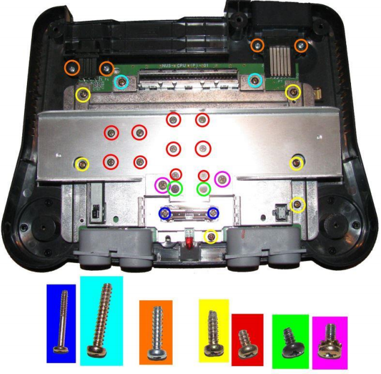
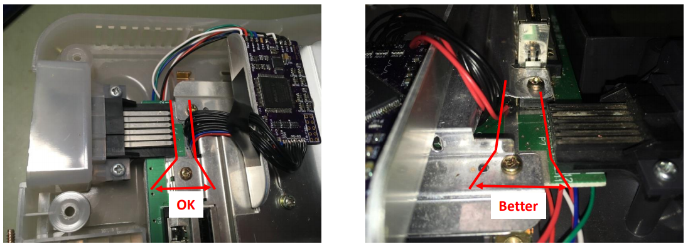
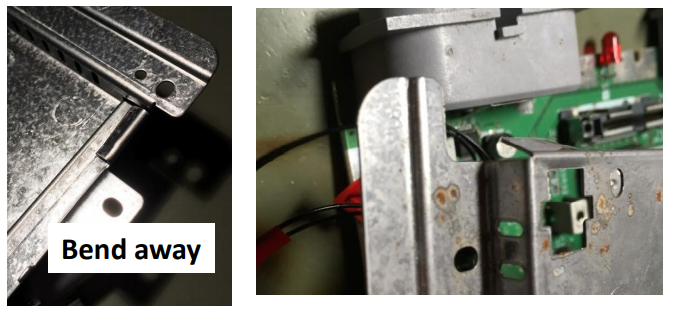
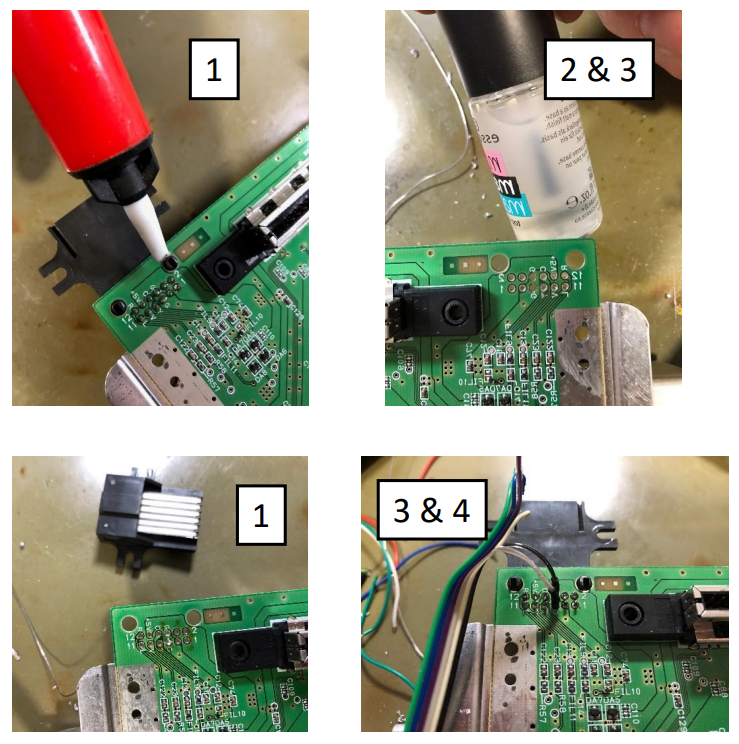
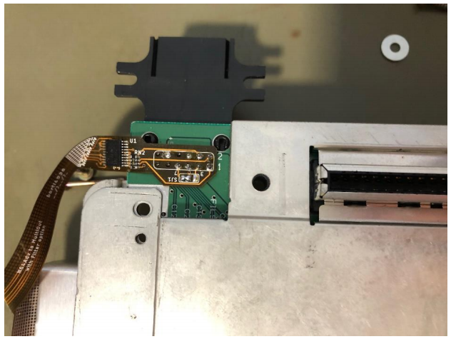
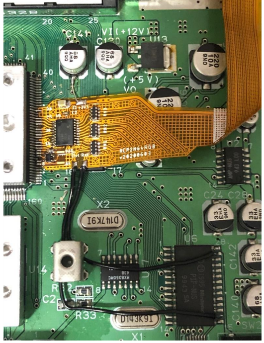
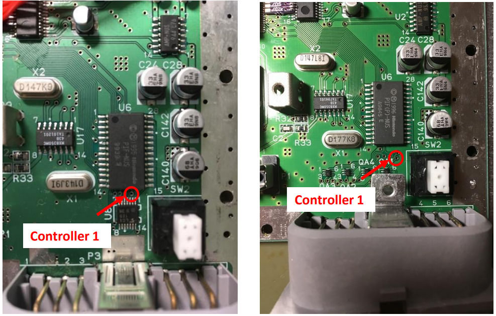
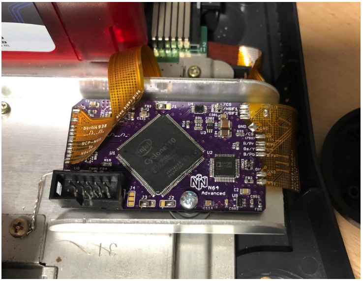

# N64 Advanced Installation and Setup Guide
## Contents
* Opening the Console
* Preparation
* Solder Work
* Cable Setup
* Controller/In Game Routines
* Menu
* Updating Firmware

## Opening the Console
* Remove Jumper Pak / Expansion Pak  
* Remove screws from bottom side of the console (needs 4.5mm game bit tool)  
* Lift up the top housing  
* Remove marked screws from inside (in some later consoles heat sink is designed differently)  
* Pull out the mainboard and remove heatsink and RF shield  

Please refer to the below image for length of screws and where they go.

## Preparation Work

### Prep - Motherboard:

* Locate the tab in the RF shield next to the Multi AV connector.  
* You can bend away part of the shield or ideally cut a small piece out. **It is much better to cut out this piece, the more distance between the wires and the Multi AV the better**. It reduces interference.

* At the front side between reset button and controller port there is a metal tab
* Slightly bend the tab here as shown in the picture, this helps later to route one of the wires.

### Prep - N64 Advanced:
Solder jumpers for default settings:  
J4.1 Closed (Default to Line Doubling Disabled)  
J33 Closed (300mV Sync)  
J1.1 Closed (required with Advanced flex)  

The line doubling is controllable via the OSD menu, this is just for defaults to get you started. Some displays do not support higher resolution over scart, so 2x and 3x modes will not work.

Solder Jumpers on Advanced Flex:  
* SJ3.2 Closed  
* SJ1.1 Closed for Sync on Pin 7 (Composite Video)  
* SJ1.2 Closed for Sync on Pin 3 (CSYNC)  

TO DO - NEED PICTURES - mounting pcb to heatsink, etc

### Prep - Isolate Multi AV Pins (Optional):

This step is currently deemed optional (but recommended) for the N64 Advanced.  

Despite being optional, its highly recommended from an electrical point of view. If you are capable (and confident) of doing this work, I recommend you do it. **If you do not have the tools or not done this type of work before - avoid it**. It isnt hard to damage the connector and/or PCB.

1. Desolder the MultiOut connector
2. Drill out the GND pads (Pin 5 and 6)
3. insulate the drills (either with varnish or small shrink tubes) in case of tiny copper remains
4. Solder MultiOut back into place

<u>Why is it needed?</u>  

* By placing the modding board rather far away from the mainboard the installation creates a so called GND loop
* If the GND loop is too long, some current (switching current) will flow to GND over signal wires, i.e. over the video outputs, which will cause distortions / noise in the picture
* This is very dominant on the N64RGBv1 as the digital and analog circuit are supplied by 3.3V.
* On the N64RGBv2 and N64Adv, the digital is supplied with 3.3v and analog with 5v. Due to this setup, the effect is negligible in practice on these mod revisions. However, electrically it is still recommended.

## Console Solder Work

### Solder Work - Flex Output:

You need to know what RGB cable you are going to use and which pin it uses for sync. Alternatively you can use pins 3, 7 and 9 all linked together. This will work with all types of RGB cable regardless of sync source, but you will not be able to use composite video or S-Video anymore.

Which ever method you use, you need to ensure the original signal going to the pin is disconnected. Its recommended to cut the trace running to the pin. This is extremely important with pin 3 (CSYNC) and PAL consoles - as originally this pin will be powered by 12v on some board revisions and will damage the flex/n64a.

Once you are ready and the pins you are intending to use are isolated, simply solder the flex as shown below.

Ensure your jumpers are set as per the prep section and match the cable you are using.

### Solder Work - Flex Input:

Solder the RCP end of the flex cable to the RCP-NUS as shown. The first pin of the flex goes to RCP-NUS Pin 8 and the last one should be at RCP-NUS Pin 28.

Solder 3.3v pad to a source of 3.3v (the capacitor at C141 is close and will work fine)

Solder the Ctrl pad to PIF-NUS Pin 16 (which is controller port 1, middle pin) and Rst to PIF-NUS Pin 27. You can use a multimeter to find alternative points or solder directly to the legs of the chip

### Solder Work - linking it all together:

With the full flex cables, you simply have to solder flex cables to the modding board
• Gently bend the cables as marked on silk screen, DO NOT bend them sharply as it will break the connections internally.
• Check for adjacent shorts with a multimeter

### Cable Setup:

With the configuration solder by Retro Gamer Stuff Limited, the N64 will be setup to use an "NTSC" SNES RGB cable.

This means:
* No resistors on the R, G, B or Sync lines (typically, Sync on Luma cables come like this. Sync on CSYNC have a resistor in line that needs removing/bypassing)  
* Capacitors on the R,G and B lines is acceptable

## Menu

To open the menu:
* Press D-pad Right + L + R + C-right

To close the menu:

* press D-pad Left + L + R + C-left or simply press B until menu has been closed

To navigate through the menu you are can use:
* D-pad up or down to select the submenu you want to enter / option you want to modify
* R or L/Z to switch between certain pages
* D-pad left or right to change an option
* A or D-pad Right to enter a submenu
* B to leave a submenu (close menu on top level menu)
* Z + L to mute the menu (menu overlay disappears as long as combination is pressed)

Options are shown in yellow if they do not match the setting stored in flash memory!

| Menu Point -VI config. 1 | Description                              |
|--------------------|------------------------------------------|
| NTSC/PAL awareness | Decide whether you want to configure linemultiplier options for both NTSC and PAL games or whether you want to apply different settings (If you opt for global settings, the NTSC setup is applied and showed in menu) |
| Linemultiplier | Change between NTSC and PAL submenu (does not applied if NTSC/PAL awareness is off) |
| - 240p/288p settings | Enters linemultiplier submenu for progressive video input |
| - 480i/576i setting | Enters linemultiplier submenu for interlaced video input |
| V/H position/timing | Enters positioning and timing submenu (Options only available for enabled linemultiplication) |
| Gamma Value | Apply gamma curve on output with 𝐼 = (𝐼<small>in</small>)𝛾, where 𝐼<small>in</small> is the input intensity and 𝛾 the gamma value (In other modifications, this is called ‘gamma boost‘ with the difference that the value is inverted) |
| VI config page 2 | Enters VI configuration page #2 |

| Menu Point - VI config. 2 | Description                              |
|-------------|------------------------------------------|
| Color Space | Selects between RGBS (RGB + separate Sync), RGBS/RGsB (RGB with sync on green) and YPbPr (Component video) (Separate sync stays enabled for all modes) |
| Exchange R&B out | Changes outputs of R and B (Pr and Pb) (Option was introduced just for a few experimental flex cables where I exchanged red and blue) |
| LowRes.-DeBlur | Select between On and Off (low resolution deblur does not apply for interlaced content) - On activates VI-DeBlur, which may improve image quality for 320x240 (low resolution) content but decreases image quality for 640x240 (high resolution) content - Off deactivates VI-DeBlur |
| - power cycle default  | VI-DeBlur default setting after a power cycle |
| 16bit mode | Select between On and Off - In 16bit mode the color depth is reduced from standard 21bit (7bit per color) to 16bit (5bit red, 6bit green and 5bit blue) by simply cutting off the LSBs |
| - power cycle default | 16bit mode default setting after a power cycle |
| VI config page 1  | Enters VI configuration page #1 |

| Menu Point - Config (240p/288p) | Description                              |
|-------------|------------------------------------------|
| Enable Linemultiplier | Disables or Enable Linemultiplier by choosing between - LineX off: disable linemultiplier - LineX2: enable linedoubler (every scanline is outputted twice) - LineX3: enable linetrippler (every scanline is outputted three times (needs VPLL to be enabled) (not available in PAL) |
| - Video PLL | Submenu to test and activate/deactivate the video PLL. The clock source of the N64 is rather weak in order to drive long installation wires. Depending on you installation the PLL does not provide a stable lock, which means that you cannot use LineX3 then. |
| Use Scanlines  | Enables scanlines for linedoubled and linetrippled 240p content |
| - Method | Choose between simple and advanced - simple: Scanline calculated based on previous (odd scanline ID) or next (even scanline ID) drawn line - advanced: Scanline calculated based on both, previous and next, drawn line |
| - Scanline ID  | Choose between even (scanline before actual drawn line) and odd (scanline after drawn line) |
| - Scanline Stength | Select the scanline strength with 𝐼 = 𝑠 × 𝐼<small>in</small>, where 𝑠 is the scanline strength and 𝐼<small>in</small> the pixel intensity |
| - Hybrid Depth | Make scanline strength pixel-intensity dependent - 0% means that scanlines are calculated as setup - 100% means that scanlines strength is reduced to 0 for maximum pixel intensity - (> 100%) means that scanline strength is reduced to 0 prior to maximum pixel intensity - (< 100%) means that scanlines are always drawn but slightly reduced with increasing pixel intensity |

| Menu Point - Config (480i/576i) | Description                              |
|-------------|------------------------------------------|
| De-Interlacing (Bob) | Disables or Enable Linedoubler by choosing between - off: disable linemultiplier - on: enable linedoubler (every scanline is outputted twice)|
| - Field-Shift Fix | Shifts all fileds half of a pixel up and down between linedoubled even and odd field reducing some typically up-down-flickering of simple bob deinterlacing in most cases |
| Use Scanlines  | Enables scanlines for linedoubled / bob-deinterlaced 480i content |
| - Method | Choose between simple and advanced - simple: Scanline calculated based on previous (odd scanline ID) or next (even scanline ID) drawn line - advanced: Scanline calculated based on both, previous and next, drawn line |
| - Scanline ID  | Choose between even (scanline before actual drawn line) and odd (scanline after drawn line) |
| - Scanline Stength | Select the scanline strength with 𝐼 = 𝑠 × 𝐼<small>in</small>, where 𝑠 is the scanline strength and 𝐼<small>in</small> the pixel intensity |
| - Hybrid Depth | Make scanline strength pixel-intensity dependent - 0% means that scanlines are calculated as setup - 100% means that scanlines strength is reduced to 0 for maximum pixel intensity - (> 100%) means that scanline strength is reduced to 0 prior to maximum pixel intensity - (< 100%) means that scanlines are always drawn but slightly reduced with increasing pixel intensity |

| Menu Point - Config (Position) | Description                              |
|-------------|------------------------------------------|
| Settings for: | Selects configuration parameters between differnt modes (mode depends on NTSC/PAL, progressive/interlaced and LineX) |
| Vertical shift  | Shifts image up (positive values) and down (negative values) (not available for passthrough mode) |
| Horizontal shift | Shifts image left (negative values) and right (positive values) |
| DeJitter for PAL LX2 | Removes line width variation in non-visible vsync area as good as possible (not by 100%, half of a pixel variation remains as this feature does not change the console timing at all) Experimental feature, which may not work for all games -> please report incompatibilities on GitHub! |
| Reset values  | Resets values to defauls (all-zero) Reset is only available if “settings for:” does not select the current mode |

| Menu Point - Misc. Config | Description                              |
|-------------|------------------------------------------|
| In-Game Routines | |
| - Reset | Enables in-game routine for reset trigger - Button combination: St. + Z + R + A + B) |
| LowRes.-DeBlur  | Enables in-game routine for LowRes.-DeBlur: - Button combination ‘ON’: St. + Z + R + C-right - Button combination ‘OFF’: St. + Z + R + C-left  |
| - 16bit mode  | Enables in-game routine for 16bit mod: - Button combination ‘ON’: St. + Z + R + C-down - Button combination ‘OFF’: St. + Z + R + C-up |
| Filter Add-On  | Select the filter cut-off for the filter add-on board - Jumper J1.1 has to be closed to have access to next option |
| - Filter Cut-Off | Select between Auto, 9.5MHz, 18MHz, 36MHz and bypassed |
| Show Test-Pattern  | Show an experimental test pattern (checkered board atm) in 240p or 480i mode (depending on actual input) |

| Menu Point - Load/Save | Description                              |
|-------------|------------------------------------------|
| Save: - Configuration | Save actual configuration to flash memory. This is needed to have actual settings applied after a power cycle. |
| Load  | Different options to load settings |
| - Last Configuration | Load the setting which are stored in flash memory |
| - Defaults from Jumper Set | Load defaults which are determined by PCB jumper settings |
| - N64 Standard | Load N64 standard setting, e.g. turn off linemultiplier These settings are also loaded if you hold down reset button while power cycle the system. |
